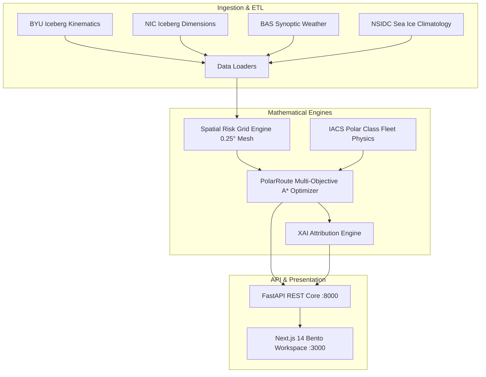

# POLARIS-X
### Polar Operational Logistics, Ice Risk & Intelligent Routing System

[](https://opensource.org/licenses/MIT)
[](https://www.python.org/)
[](https://nextjs.org/)
[](https://fastapi.tiangolo.com/)
[]()
[]()

---

## 🧭 Overview

**POLARIS-X** is an enterprise-grade AI decision-support platform designed for Antarctic research vessel navigation addressing **Ministry of Earth Sciences (MoES) / National Centre for Polar and Ocean Research (NCPOR) Problem Statement 26059**.

The platform operationalizes a human-in-the-loop decision-support paradigm (**Observe $\rightarrow$ Forecast $\rightarrow$ Predict $\rightarrow$ Simulate $\rightarrow$ Optimize $\rightarrow$ Explain $\rightarrow$ Alert**) across the active Antarctic Peninsula and Weddell Sea "Golden Demonstration Corridor" (`-78°S` to `-52°S`, `-75°W` to `-25°W`).

---

## ⚡ Key Capabilities

1. **Real Antarctic Multi-Source Data Ingestion**:
   - **BYU ASCAT Daily Kinematics** (`stats_database_v7.1.zip`): 1,300+ daily trajectory records for mega-icebergs **A68A**, **A23A**, and **A64**.
   - **National Ice Center (NIC) Weekly Bulletins** (`archive.zip`): Iceberg physical dimensions (Length NM, Width NM) and grounded/drifting statuses.
   - **British Antarctic Survey (BAS) Surface Meteorology** (`surface_met.zip`): Synoptic time series across 8 Antarctic stations (Rothera, Faraday, Grytviken, Signy, Halley).
   - **NSIDC 40-Year Climatology** (`monthly-sea-ice-extent-in-the-antarctic.csv`): Monthly sea-ice baseline & anomaly scaling.

2. **2D Composite Spatial Navigation Risk Grid**:
   - High-resolution $0.25^\circ \times 0.25^\circ$ discrete marine lattice.
   - Anisotropic Gaussian iceberg collision probability density fields oriented along dynamic drift velocity vectors ($\vec{v}_{\text{drift}}$).
   - Inverse Distance Weighting (IDW) meteorological impedance interpolation.
   - Continental ice shelf & Antarctic Peninsula piecewise spline landmass masking.

3. **IACS Polar Class Marine Physics**:
   - **Class 1: Research PRV (PC-5)** — *MV Vasiliy Golovnin* (14.0 kts, max ice 70%, $K_{\text{hull}} = 1.8$).
   - **Class 2: Heavy Polar Icebreaker (PC-2)** (16.5 kts, max ice 100%, $K_{\text{hull}} = 1.0$).
   - **Class 3: Commercial Non-Ice Class** (12.0 kts, max ice 15%, $K_{\text{hull}} = 4.5$).
   - Non-linear speed degradation and cubic bunker fuel proxy curves.

4. **Multi-Objective A\* Pathfinding Engine**:
   - Great-Circle Haversine admissible heuristic ensuring monotonic optimality.
   - Solves for lowest-cost **Recommended Safe Passage** vs unadjusted **Direct Shortest Track**.
   - Computes segment-by-segment ETAs, voyage distance (NM), and bunker fuel consumption index.

5. **Explainable AI (XAI) Attribution Service**:
   - Translates mathematical multi-objective tradeoffs into transparent natural language narratives for bridge officers.
   - Generates quantitative attribution waterfall factors (Iceberg Hazard Exposure, Pack Ice Impedance, Voyage Detour %, Fuel Adjustment %).

6. **Executive Maritime Bento Cockpit UI**:
   - Clean, high-readability daylight interface (Slate-50 `#F8FAFC`, Pure White `#FFFFFF`, Slate-200 `#E2E8F0`, Sky-600 `#0284C7`).
   - Interactive Polar Geospatial SVG map with dynamic drift vectors, radar pulse indicators, and weather tags.
   - Dynamic iceberg surge simulation demo triggering evasive rerouting.

---

## 🏗️ Architecture



---

## 🚀 Quickstart Guide

### Prerequisites
- **Python 3.10+**
- **Node.js 18+** and **npm**

### 1. Backend Setup (FastAPI)
```bash
# Navigate to backend directory
cd backend

# Install dependencies
pip install -r requirements.txt

# Run automated verification test suite
pytest -v tests/

# Start FastAPI server
uvicorn app.main:app --host 127.0.0.1 --port 8000 --reload
```
* Backend API: `http://127.0.0.1:8000`
* Swagger Interactive Docs: `http://127.0.0.1:8000/docs`

### 2. Frontend Setup (Next.js 14)
```bash
# In a new terminal, navigate to frontend directory
cd frontend

# Install dependencies
npm install

# Start Next.js development server
npm run dev -- -p 3000
```
* Executive Cockpit: `http://localhost:3000`

---

## 🧪 Automated Testing & Verification

The test suite validates data extraction, vessel physics degradation, geodesic accuracy, pathfinding, XAI attribution, and REST endpoints:

```bash
cd backend
pytest -v tests/
```

Expected Output:
```text
============================= test session starts =============================
collected 17 items

tests/test_api_endpoints.py::test_health_endpoint PASSED                 [  5%]
tests/test_api_endpoints.py::test_vessels_endpoint PASSED                [ 11%]
tests/test_api_endpoints.py::test_stations_endpoint PASSED               [ 17%]
tests/test_api_endpoints.py::test_layers_endpoint PASSED                 [ 23%]
tests/test_api_endpoints.py::test_route_computation_endpoint PASSED      [ 29%]
tests/test_api_endpoints.py::test_simulate_reroute_endpoint PASSED       [ 35%]
tests/test_loaders.py::test_julian_conversions PASSED                    [ 41%]
tests/test_loaders.py::test_load_nic_dimensions PASSED                   [ 47%]
tests/test_loaders.py::test_load_iceberg_kinematics PASSED               [ 52%]
tests/test_loaders.py::test_get_active_icebergs PASSED                   [ 58%]
tests/test_loaders.py::test_load_surface_meteorology PASSED              [ 64%]
tests/test_loaders.py::test_load_sea_ice_climatology PASSED              [ 70%]
tests/test_routing_engine.py::test_haversine_accuracy PASSED             [ 76%]
tests/test_routing_engine.py::test_landmass_masking PASSED               [ 82%]
tests/test_routing_engine.py::test_vessel_speed_and_fuel_degradation PASSED [ 88%]
tests/test_routing_engine.py::test_end_to_end_route_optimization PASSED  [ 94%]
tests/test_routing_engine.py::test_xai_explanation_generation PASSED     [100%]

============================= 17 passed in 33.17s =============================
```

---

## 📄 Documentation Suite

* [POLARIS_X_MASTER_CONTEXT.md](POLARIS_X_MASTER_CONTEXT.md) — Master architecture, complete dataset audit, and mathematical formulations.
* [PRD.md](PRD.md) — Product Requirements Document for MoES/NCPOR Problem Statement 26059.
* [tech_stack.md](tech_stack.md) — Technology stack specification.
* [schema.md](schema.md) — PostGIS geospatial database schema and Pydantic contracts.
* [app_flow.md](app_flow.md) — Bridge officer operational journey and state machine.
* [design.md](design.md) — Executive Maritime Design System guidelines.
* [plan.md](plan.md) — 8-phase production roadmap.
* [ui_ux_blueprint.md](ui_ux_blueprint.md) — Screen inventory and Cockpit layout anatomy.

---

## 📜 License
MIT License. Developed for Antarctic marine navigation safety and logistics optimization.
